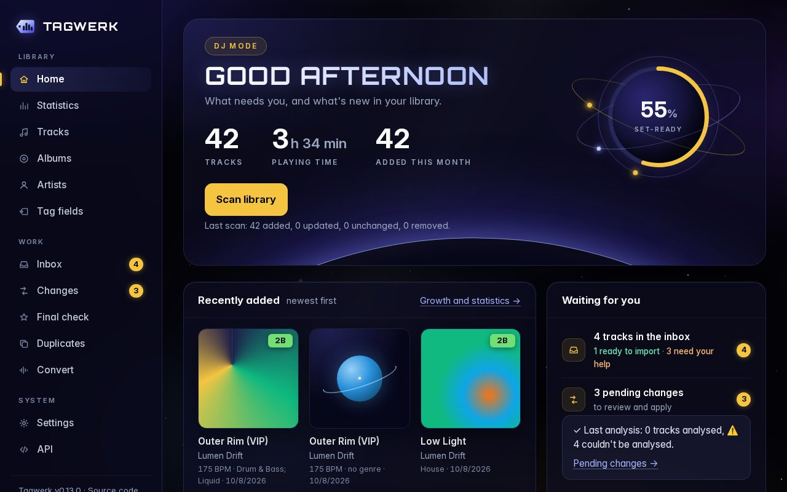
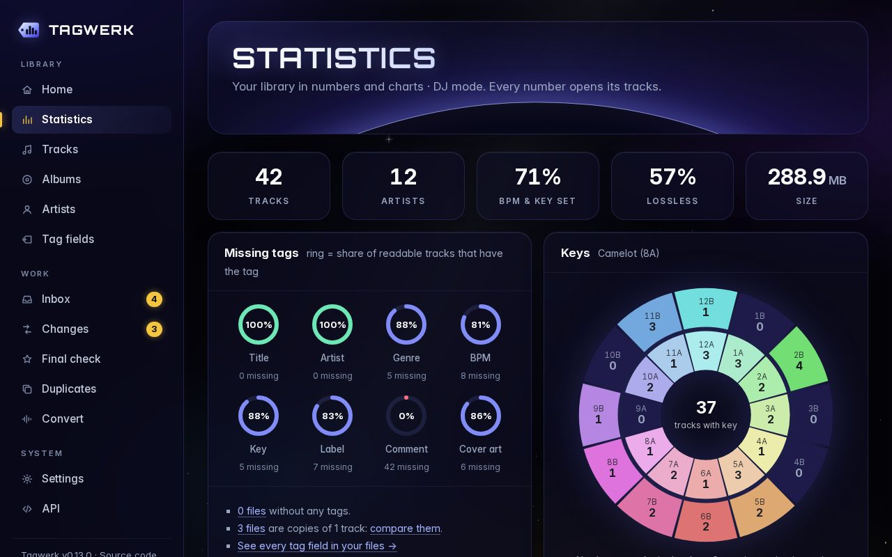
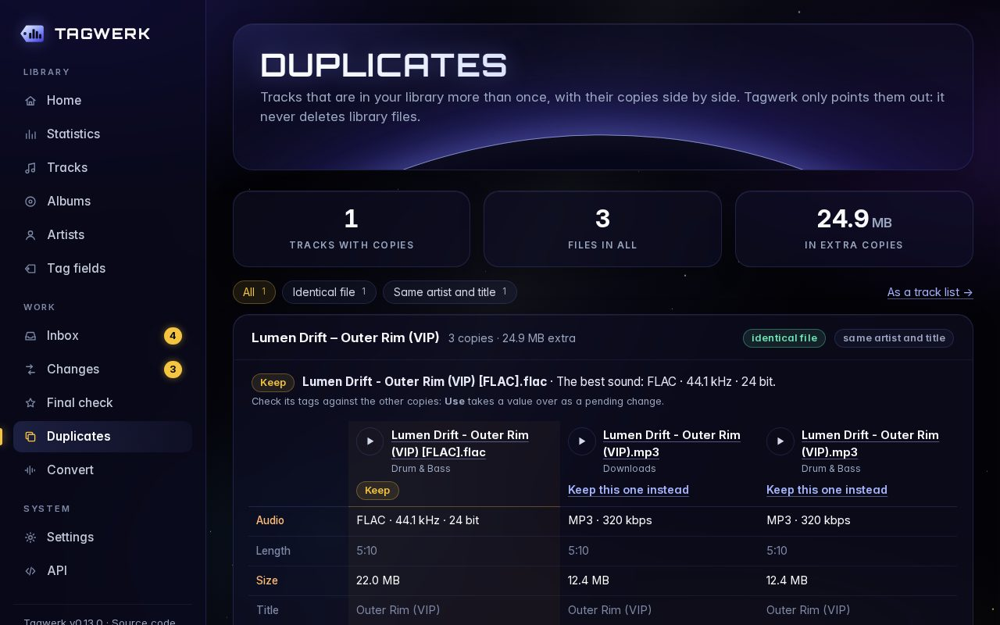
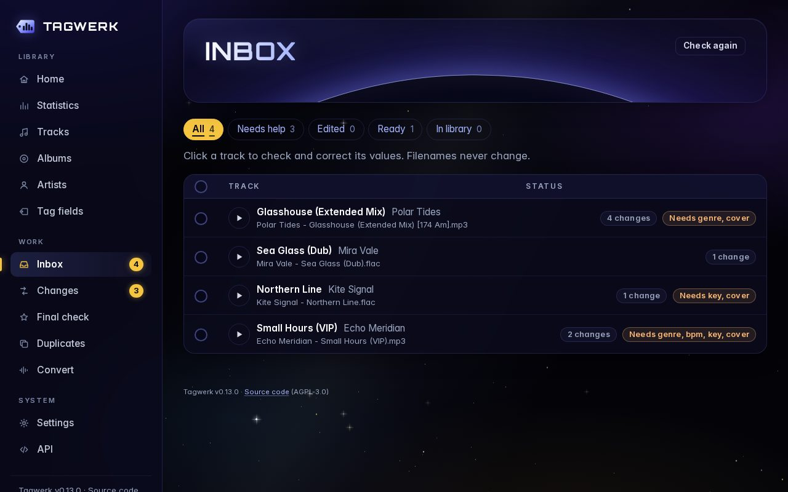
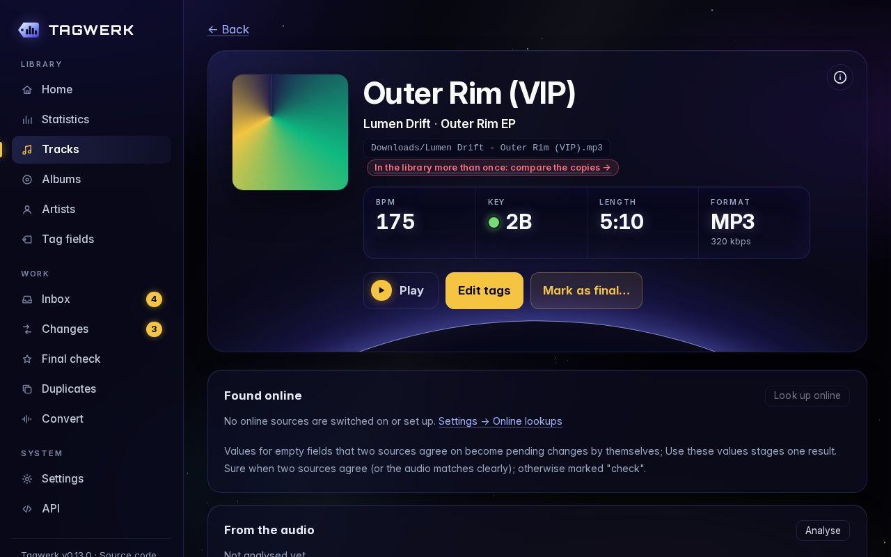

# Tagwerk

A self-hosted music library manager, built to run in Docker on Unraid next to Navidrome.

> **Status: v0.16, working towards 1.0.** Scanning, statistics, editing tags with review and undo, the import inbox, online identification, BPM and key from the audio, final tracks and duplicates all work, in a night-sky look. What's left before 1.0 is checking it on a real library; see the [roadmap](docs/roadmap.md).



<table>
  <tr>
    <td></td>
    <td></td>
  </tr>
  <tr>
    <td></td>
    <td></td>
  </tr>
</table>

<sub>Screenshots from a made-up showcase library (`scripts/showcase_library.py`): invented artists, generated covers.</sub>

## Features

**Safe by design:** Tagwerk only writes files when you say so (or, if you switch on automatic mode, when it imports inbox tracks it is sure about). Every change is staged, shown as *old → new* with where the value came from, and written only when you click **Apply**: all of them, or only the ones you tick. The previous tags are kept, so every change can be undone. Filenames stay as they are unless you choose otherwise.

**Your library**
- **Library scan:** reads MP3, FLAC, WAV, AIFF, M4A, OGG and Opus (ID3, Vorbis comments, MP4 tags, RIFF INFO), including BPM, key, comment, label, catalog number, ReplayGain and lyrics (embedded or `.lrc`). Read-only; unchanged files are skipped on rescans.
- **Home:** what needs you right now (inbox, pending changes, things worth fixing) and what was added recently.
- **Statistics:** a heat map of any two of key, tempo, release year, year added, genre and format (e.g. key × tempo for harmonic mixing), library growth, set-ready share per genre, track lengths, top labels and artists, formats and quality. Every number links to its tracks.
- **Tagwerk's work:** what Tagwerk has done for your library: tag values filled in, corrected or removed per field, where they came from (you, the audio, online, the filename …), imports, conversions, and how many tracks were set-ready before and are now.
- **Made for DJs:** BPM, keys in Camelot, Open Key or musical notation, set-readiness and audio quality come first on every page.
- **Browse and search:** track list with filters and sorting, artists, albums, a page per track with all tags and its cover, and a **play bar** that keeps playing while you browse.
- **Duplicates:** tracks that are in your library more than once (identical files, the same recording, or the same artist and title at the same length), with their copies side by side. Tagwerk suggests keeping the one with the best sound and lets you take tags and covers over from the others; then move the others to the trash. They stay there, restorable, until you empty it: Tagwerk never removes a library file on its own.
- **Tag fields page:** every tag field in your files (including ones Tagwerk ignores, like beaTunes or Serato data), how many files use it, and the most common values. Private data of other programs (e.g. Traktor's waveform and cue points) can be removed.

**Tagging**
- **Edit tags** of one track or many at once, in all 7 formats.
- **BPM and key from the audio**, made for bass-heavy music like drum & bass: an exact tempo, half/double time settled by genre, filename and online sources, keys tuned for sub-bass. Empty fields get filled, tags that differ get flagged. Uses all CPU cores you give the container.
- **Online identification:** MusicBrainz, AcoustID (by the sound), Discogs, Deezer and iTunes fill empty fields and covers; a value is *sure* when two sources agree. MusicBrainz checks are optional, since edits, bootlegs and promos usually aren't on MusicBrainz.
- **Fix IDs:** MusicBrainz fields holding Discogs numbers are cleaned up; the numbers move to their own fields.
- **Final tracks:** mark checked tracks as final (locked), optionally renamed by a pattern you choose.
- **Convert to AIFF:** lossless tracks (FLAC, WAV, ALAC) with all tags and covers; the originals are kept.

**New music**
- **Import inbox:** new music waits in its own folder. Tagwerk suggests tags from the filename, online sources and the audio, and tidies existing ones (spacing, "feat.", genre spelling, `(club remix)` → `(Club Remix)`). You check each track, then import: tags are written and the file moves into the library by genre, **with its filename unchanged**. Undo moves it back. Duplicates are marked; unwanted files go to a trash you can restore from.
- **Automatic mode** (optional): complete tracks Tagwerk is sure about are imported without asking.
- **Navidrome rescan** after every change, so new tags and tracks show up there right away (optional).

**Look:** the night sky: a dark, space-inspired design with glass panels and slowly drifting stars, plus a Lighter effects switch for weak devices.

Next (see the [roadmap](docs/roadmap.md)): checks on a real library before 1.0, then Navidrome numbers on Home.

## Install on Unraid

1. Open the Unraid **Terminal** (top right `>_` icon) and download the template once:
   ```sh
   wget -O /boot/config/plugins/dockerMan/templates-user/my-tagwerk.xml \
     https://raw.githubusercontent.com/dooziedan/tagwerk/main/unraid/tagwerk.xml
   ```
2. Go to **Docker → Add Container**, choose **Tagwerk** in the *Template* dropdown (under user templates) and fill in:

   | Field | What to enter |
   |---|---|
   | **Music Library** (required) | Your music share, for example `/mnt/user/music`. Use the same folder as your Navidrome container. |
   | App Data | Leave the default `/mnt/user/appdata/tagwerk` |
   | Import Inbox (optional) | A folder for new music, e.g. `/mnt/user/music-inbox`. Use a folder **outside** your music share, so Navidrome doesn't show unfinished tracks. |
   | Navidrome URL / User / Password (optional) | e.g. `http://192.168.1.10:4533` and a Navidrome user with admin rights, so Tagwerk can trigger a rescan. Not `localhost`. |
   | Navidrome Library (optional) | If Navidrome has several libraries: the name of the one using your music folder, e.g. `Music Library`. |
   | Original Files (optional) | Where originals go after converting to AIFF, e.g. `/mnt/user/music-originals`, outside your music share. |
   | AcoustID Key / Discogs Token (optional) | Free keys for online identification; the template explains where to get them. |
   | CPU Cores | `0` (automatic) uses every core the container may use for BPM and key analysis; e.g. `4` leaves the rest for other containers. |
   | WebUI Port | `8000`, or any free port |
   | PUID / PGID (advanced) | Leave Unraid's defaults `99` / `100` |

3. Click **Apply**, then open the WebUI. The setup wizard guides you through the first start; Home checks that the folders are mounted correctly.

> **Back up your music before the first tag write.** Tagwerk keeps the old tags for undo, but a backup is the real safety net.

## First steps

1. **The setup wizard** asks how keys should be shown, where imported tracks go (genre folders by default, filenames never change) and how independently Tagwerk may import. Everything can be changed later in **Settings**.
2. **Scan your library** on Home. Scanning only reads your files. Home then shows what needs you, and **Statistics** shows your library in numbers; every number opens its tracks.
3. **Fix tags**: open a track and choose **Edit tags**, or tick tracks in the list and edit them together. Nothing is written yet: changes wait on the **Changes** page, shown as *old → new*. Tick what you want and **Apply**; **History** undoes any apply.
4. **New music** goes into the import folder. The **Inbox** shows what Tagwerk found (from the filename, online sources and the audio); check a track, then **Import** it into the library.
5. **Duplicates** lists tracks you have more than once. Keep the suggested copy, take over what the others have, then move the others to the trash (restorable until you empty it).
6. **Final check**: mark finished tracks as final; they're locked against changes (and renamed, if you switch that on).

## Configuration

All settings are environment variables (the fields in the Unraid template):

| Variable | Default | Meaning |
|---|---|---|
| `MUSIC_DIR` | `/music` | Music library path inside the container |
| `CONFIG_DIR` | `/config` | Database, settings and images (covers kept for undo) |
| `IMPORT_DIR` | `/import` | Import inbox (optional) |
| `NAVIDROME_URL` / `NAVIDROME_USER` / `NAVIDROME_PASSWORD` | empty | Navidrome to rescan after changes (optional; admin user) |
| `NAVIDROME_LIBRARY` | empty | With several Navidrome libraries: the name of the one using your music folder; only it is rescanned |
| `ORIGINALS_DIR` | `/originals` | Where originals go after converting to AIFF (optional) |
| `ACOUSTID_KEY` / `DISCOGS_TOKEN` | empty | Free keys for online identification (optional) |
| `CPU_CORES` | `0` | CPU cores Tagwerk may use for heavy work (BPM and key analysis: one track per core). `0` = as many as the container may use (limit with `cpus:` in docker-compose, `--cpus` or Unraid's CPU pinning), fewer if memory is short. Before v0.13 this was `ANALYSIS_WORKERS`, which still works |
| `LOG_LEVEL` | `info` | How much goes to the container log: `debug`, `info`, `warning`, `error` |
| `PUID` / `PGID` | `99` / `100` | User and group the app runs as |
| `UMASK` | `022` | Permission mask for new files |

## Documentation

- [Roadmap](docs/roadmap.md): the development phases
- [Architecture](docs/architecture.md): how the app is built
- [Development](docs/development.md): run it locally, tests, releases
- [Decisions](docs/decisions/): why things are the way they are
- [Changelog](CHANGELOG.md)

The REST API is documented at `/docs` on any running instance.

## License

[GNU AGPL-3.0-or-later](LICENSE). You may use, modify and share Tagwerk. If you distribute a modified version, or let others use one over a network, you must make its source code available under the same license.
